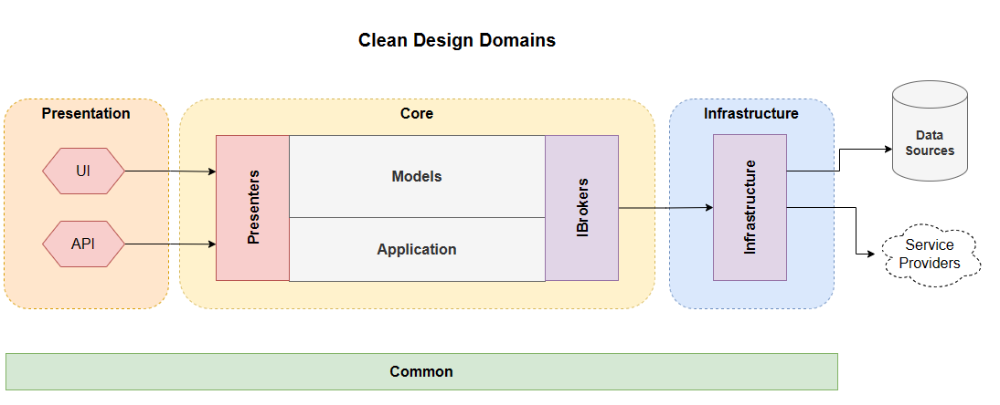

# Building Blazor Delect and ListData Controls

## Articles

1. [AutoComplete Control](./AutoComplete-Control.md)
2. [Cascading Select](./Cascading-Select.md)
3. [The Data Pipeline](./Data-Pipeline.md)

## Coding Conventions

1. `Nullable` is enabled globally.  Null error handling relies on it.
2. Net7.0.
3. C# 10.
4. Data objects are immutable: records.
5. `sealed` by default.

## Clean Design Architecture

